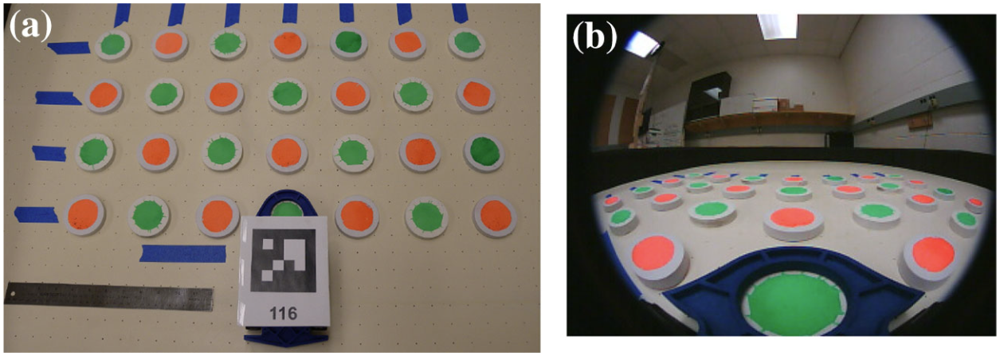

# Introduction

Scripts to calibrate a conversion between image and real-world coordinates.

Context: A mobile robot operating in the plane, viewing a set of targets (pucks).
Given the position of a puck in the image (xi, yi), we would like to obtain the 
corresponding real-world coordinates (xr, yr). The approach taken here is to
lay out a set of targets in a grid, capture an image, then get the user to
manually select these targets by running `correspondences_from_picks.py`.
Then run `interpolator.py` to interpolate between the selected points. The
result is `interpolated_correspondences.csv` which can then be used as a
lookup-table to convert from (xi, yi) to (xr, yr).

This approach was first described in the following paper:

Vardy, A., Vorobyev, G. & Banzhaf, W. Cache consensus: rapid object sorting by a robotic swarm. Swarm Intell 8, 61–87 (2014). https://doi.org/10.1007/s11721-014-0091-5

# Instructions

Set the name of the input image in `correspondences_from_picks.py` along with
parameters of the grid of target objects. If using ROS, you could potentially
use `correspondences_from_tags.py` (but this file has not been touched in
many years). The result is `known_correspondences.csv`.

Next, run `interpolator.py`.  It produces the file `interpolated_correspondences.csv`.

# History

First written around April 2014. Updated in April 2025.

Andrew Vardy